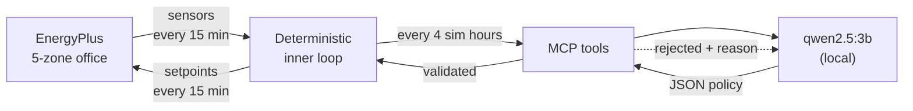

# Eco-Loop — closed-loop building control with a local LLM

A local language model supervises a live EnergyPlus simulation. It reads
sensors and writes thermostat setpoints **while the simulation is running**,
through an MCP tool layer, and cuts electricity use without pushing occupants
outside their comfort band.

Everything runs on one machine. The model is `qwen2.5:3b-instruct` on Ollama —
deliberately small, which is why the validation layer around it does real work.

---

## Results

Three summer weeks (1–21 July), Chicago TMY3, 5-zone VAV office. **Identical
building, weather and run period — the only variable is the controller.**

| Controller | kWh | Saved | HVAC kWh | HVAC saved | Peak kW | Comfort violations |
|---|---|---|---|---|---|---|
| Baseline (stock schedules) | 3059.74 | — | 904.23 | — | 20.22 | 0.00% |
| Rule-based (no LLM) | 2990.15 | +2.27% | 832.82 | +7.90% | 19.65 | 0.00% |
| **LLM agent (supervisory)** | **2958.16** | **+3.32%** | **800.20** | **+11.50%** | **19.46** | **0.00%** |
| `agent_optimized.idf` (exported) | 2943.65 | +3.79% | — | — | — | 0.00% |

**3.32 % of facility electricity, 11.5 % of HVAC electricity, zero comfort
violations** — and the agent beats the rule-based controller by 1.05 percentage
points while also cutting peak demand 3.7 %.

Two caveats stated up front:

- **HVAC is the fairer number.** Lights and plug loads are ~70 % of facility
  electricity and thermostats cannot touch them. The 11.5 % figure is what the
  controller actually influences.
- **The exported IDF beats the live agent** (3.79 % vs 3.32 %) because taking
  the median per (day type, hour) discards the 3B model's occasional outlier
  decisions. That gap *is* the model's inconsistency, quantified.

### Agent telemetry

| | |
|---|---|
| Model | `qwen2.5:3b-instruct` (local, Ollama) |
| Supervisory decisions | 126 (one per 4 simulated hours) |
| Model invocations | 102 (retries included) |
| Served from cache | 40 — **31.7 %** hit rate |
| Malformed JSON | **0** |
| Tool rejections → self-corrected | 17 → 16 retries |
| Fell back to rule-based | **1** of 126 |
| Median latency | 3.27 s |
| Safety-clamp violations | **0** |
| Wall clock | 360 s total, of which the simulation is **12 s** |

The loop is sound — zero malformed JSON, one fallback in 126 decisions. What
limits savings is model *judgment*, not plumbing.

---

## The idea in one picture



The LLM is a **supervisor**, not a per-timestep controller. It sets policy every
four simulated hours; a deterministic loop applies and guards that policy at
every 15-minute timestep. Full reasoning in
[ARCHITECTURE.md](ARCHITECTURE.md).

---

## Setup

**Prerequisites**

1. **EnergyPlus 26.1** — <https://energyplus.net/downloads>. The default Windows
   path `C:\EnergyPlusV26-1-0` is assumed; change `ENERGYPLUS_DIR` in
   [src/config.py](src/config.py) if yours differs. `pyenergyplus` ships with it.
2. **Ollama** — <https://ollama.com>, then pull the model:

```bash
ollama pull qwen2.5:3b-instruct
```

**Install** — into a virtual environment, so the pinned versions stay isolated.

```bash
python -m venv .venv
```

Activate it (Windows PowerShell):

```bash
.venv\Scripts\Activate.ps1
```

On macOS/Linux use `source .venv/bin/activate` instead. Then:

```bash
pip install -r requirements.txt
```

Every command below assumes the environment is active. If you would rather not
activate it, call the interpreter directly: `.venv\Scripts\python.exe src/...`.

`pyenergyplus` is **not** a pip package — it ships with EnergyPlus, and the code
adds it to `sys.path` at runtime from `ENERGYPLUS_DIR`.

---

## Run it

Build the instrumented model:

```bash
python src/prepare_model.py
```

Run all three controllers back to back (~6 minutes, almost all of it LLM time):

```bash
python src/run_experiment.py --mode all
```

Build the report:

```bash
python dashboard/build_report.py
```

Open `dashboard/report.html` — self-contained, no server, no network.

### Individual pieces

```bash
python src/run_experiment.py --mode baseline
```

```bash
python src/export_idf.py
```

```bash
python src/log_tools.py out/big_log2/eplusout.err 15
```

---

## Verify it works

Three checks, each answering a specific doubt:

```bash
python src/test_clamp.py
```
Safety clamp against hostile input — out-of-range values, strings, `None`,
`NaN`/`inf`, booleans, inverted setpoints, malformed LLM payloads.

```bash
python src/test_actuation.py
```
Proves the actuators are genuinely connected: a loose deadband must *lower*
energy and a tight one must *raise* it. Movement in only one direction usually
means the actuator is silently not applied.

```bash
python src/test_mcp_client.py
```
Standalone MCP client over stdio. Starts a real simulation in a background
thread and calls all five tools **while it is still running**.

---

## What is in the repo

| Path | |
|---|---|
| `src/` | Runner, safety layer, MCP server, agent, metrics, tests |
| `models/baseline.idf` | Untouched `5ZoneAirCooled` from EnergyPlus ExampleFiles |
| `models/agent_optimized.idf` | **The agent's learned policy, baked into a standalone model** |
| `results/` | Metrics and timeseries per mode |
| `dashboard/report.html` | Self-contained savings report |
| `docs/ARCHITECTURE.md` | Tool calling, prompting, latency, log handling |

### `agent_optimized.idf`

Actuating the EnergyPlus API leaves no file behind — the setpoints exist only in
memory. `src/export_idf.py` reconstructs what the agent actually applied into
real `Schedule:Compact` objects and writes a model that runs **with no LLM, no
MCP server and no Python in the loop**.

The median is taken per (day type, hour) bucket, which discards the occasional
outlier decision from a 3B model. The exported model therefore performs slightly
*better* than the live agent run.

---

## The building

`5ZoneAirCooled` from the EnergyPlus example files: five conditioned zones plus
an unconditioned return plenum, VAV with reheat, Chicago TMY3 weather.

The baseline's occupied deadband is **22.2–23.9 °C** — only 1.7 °C wide, which
is what leaves room to save. Control targets the `Htg-SetP-Sch` and
`Clg-SetP-Sch` schedules through `Schedule:Compact` actuators.

Comfort is measured as the share of **occupied** zone-timesteps outside
20–25 °C. The plenum is excluded — nobody is in it.

---

## Honest limitations

- **One building, one climate, three summer weeks.** Nothing here shows the
  policy generalises to another building or to winter.
- **The savings ceiling is low by construction.** With comfort held at
  20–25 °C, roughly 2.5–3 % of facility electricity is available. Letting zones
  drift to 27 °C reaches ~7 %, but breaks comfort, so it is not claimed.
- **A 3B model is inconsistent.** Run-to-run variance is comparable to the
  effect of prompt changes. `src/compare_models.py` runs the identical loop
  against a different model to isolate this; the larger Ollama cloud models
  need a paid subscription, so that comparison is not included.
- **Facility percentages are diluted.** Lights and plug loads are unaffected by
  thermostat policy, so the HVAC-only figure is the fairer measure of what the
  controller actually influences. Both are reported.
- **No weather forecast.** The agent reacts to current conditions; it cannot
  pre-cool ahead of a hot afternoon. That is the most promising next step.
- **Comfort is a temperature band, not PMV.** The model's `People` objects do
  not specify a Fanger comfort model, and adding one was out of scope.
