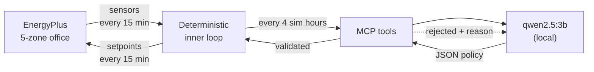

# Eco-Loop: closed-loop building control with a local LLM

A local language model supervises a live EnergyPlus simulation. It reads
sensors and writes thermostat setpoints **while the simulation is running**,
through an MCP tool layer, and cuts electricity use without pushing occupants
outside their comfort band.

---

## Results

Three summer weeks (1–21 July), Chicago TMY3, 5-zone VAV office. **Identical
building, weather and run period — the only variable is the controller.**

| Controller                       | kWh         | Saved      | HVAC kWh   | HVAC saved  | Peak kW   | Comfort violations |
| -------------------------------- | ----------- | ---------- | ---------- | ----------- | --------- | ------------------ |
| Baseline (stock schedules)       | 3059.74     | —          | 904.23     | —           | 20.22     | 0.00%              |
| Rule-based (no LLM)              | 2990.15     | +2.27%     | 832.82     | +7.90%      | 19.65     | 0.00%              |
| **LLM agent (supervisory)**      | **2958.16** | **+3.32%** | **800.20** | **+11.50%** | **19.46** | **0.00%**          |
| `agent_optimized.idf` (exported) | 2943.65     | +3.79%     | —          | —           | —         | 0.00%              |

**3.32 % of facility electricity, 11.5 % of HVAC electricity, zero comfort
violations** — and the agent beats the rule-based controller by 1.05 percentage
points while also cutting peak demand 3.7 %.

### Agent telemetry

|                                  |                                                  |
| -------------------------------- | ------------------------------------------------ |
| Model                            | `qwen2.5:3b-instruct` (local, Ollama)            |
| Supervisory decisions            | 126 (one per 4 simulated hours)                  |
| Model invocations                | 102 (retries included)                           |
| Served from cache                | 40 — **31.7 %** hit rate                         |
| Malformed JSON                   | **0**                                            |
| Tool rejections → self-corrected | 17 → 16 retries                                  |
| Fell back to rule-based          | **1** of 126                                     |
| Median latency                   | 3.27 s                                           |
| Safety-clamp violations          | **0**                                            |
| Wall clock                       | 360 s total, of which the simulation is **12 s** |

---

## The idea in one picture



The LLM is a **supervisor**, not a per-timestep controller. It sets policy every
four simulated hours; a deterministic loop applies and guards that policy at
every 15-minute timestep. Full reasoning in the [Architecture](#architecture)
section below.

---

## Setup

**Prerequisites**

1. **EnergyPlus 26.1** — <https://energyplus.net/downloads>. The default Windows
   path `C:\EnergyPlusV26-1-0` is assumed; change `ENERGYPLUS_DIR` in
   [src/config.py](src/config.py) if yours differs. `pyenergyplus` ships with it.
2. **Ollama** — <https://ollama.com>, then pull the model:

```bash
ollama pull qwen2.5:3b-instruct
```

**Install** — into a virtual environment, so the pinned versions stay isolated.

```bash
python -m venv .venv
```

Activate it (Windows PowerShell):

```bash
.venv\Scripts\Activate.ps1
```

On macOS/Linux use `source .venv/bin/activate` instead. Then:

```bash
pip install -r requirements.txt
```

Every command below assumes the environment is active. If you would rather not
activate it, call the interpreter directly: `.venv\Scripts\python.exe src/...`.

`pyenergyplus` is **not** a pip package — it ships with EnergyPlus, and the code
adds it to `sys.path` at runtime from `ENERGYPLUS_DIR`.

---

## Run it

Build the instrumented model:

```bash
python src/prepare_model.py
```

Run all three controllers back to back (~6 minutes, almost all of it LLM time):

```bash
python src/run_experiment.py --mode all
```

Build the report:

```bash
python dashboard/build_report.py
```

Open `dashboard/report.html` — self-contained, no server, no network.

### Individual pieces

```bash
python src/run_experiment.py --mode baseline
```

```bash
python src/export_idf.py
```

```bash
python src/log_tools.py out/big_log2/eplusout.err 15
```

---

## Verify it works

Three checks, each answering a specific doubt:

```bash
python src/test_clamp.py
```

Safety clamp against hostile input — out-of-range values, strings, `None`,
`NaN`/`inf`, booleans, inverted setpoints, malformed LLM payloads.

```bash
python src/test_actuation.py
```

Proves the actuators are genuinely connected: a loose deadband must _lower_
energy and a tight one must _raise_ it. Movement in only one direction usually
means the actuator is silently not applied.

```bash
python src/test_mcp_client.py
```

Standalone MCP client over stdio. Starts a real simulation in a background
thread and calls all five tools **while it is still running**.

---

## Repository map

| Path                         | Purpose                                                         |
| ---------------------------- | --------------------------------------------------------------- |
| `src/config.py`              | Single source of truth: zones, schedules, limits, run period    |
| `src/prepare_model.py`       | Trims the stock example to a run week and instruments it        |
| `src/eplus_runner.py`        | In-process EnergyPlus runner; sensing and actuation callbacks   |
| `src/policy.py`              | `Policy`, `clamp_pair`, `operating_envelope` — the safety layer |
| `src/controllers.py`         | Deterministic controllers (baseline, fixed, rule-based)         |
| `src/mcp_server.py`          | FastMCP stdio server exposing the five tools                    |
| `src/mcp_bridge.py`          | Sync facade over the async MCP session                          |
| `src/agent.py`               | LLM supervisor: prompt, schema, self-correction, cache          |
| `src/log_tools.py`           | `.err` filter / dedupe / truncate pipeline                      |
| `src/metrics.py`             | Metrics computed from `eplusout.csv`                            |
| `src/run_experiment.py`      | Runs the three modes and writes comparable results              |
| `src/export_idf.py`          | Bakes the agent's policy into `agent_optimized.idf`             |
| `src/compare_models.py`      | Side experiment: same loop, different LLM                       |
| `src/endurance_run.py`       | Runs the identical pipeline over a full cooling season          |
| `src/test_clamp.py`          | Safety-clamp unit tests                                         |
| `src/test_actuation.py`      | Proves actuation moves energy in both directions                |
| `src/test_mcp_client.py`     | Standalone MCP client; exercises tools mid-simulation           |
| `dashboard/build_report.py`  | Builds the self-contained HTML report                           |
| `models/baseline.idf`        | Untouched `5ZoneAirCooled` from EnergyPlus ExampleFiles         |
| `models/agent_optimized.idf` | **The agent's learned policy, baked into a standalone model**   |
| `results/`                   | Metrics and timeseries per mode                                 |

## The building

`5ZoneAirCooled` from the EnergyPlus example files: five conditioned zones plus
an unconditioned return plenum, VAV with reheat, Chicago TMY3 weather.

The baseline's occupied deadband is **22.2–23.9 °C** — only 1.7 °C wide, which
is what leaves room to save. Control targets the `Htg-SetP-Sch` and
`Clg-SetP-Sch` schedules through `Schedule:Compact` actuators.

Comfort is measured as the share of **occupied** zone-timesteps outside
20–25 °C. The plenum is excluded — nobody is in it.

---

## Architecture

A local LLM supervises a live EnergyPlus simulation through an MCP tool layer,
reading sensors and writing thermostat setpoints while the simulation runs.
Five sections: the tool-calling architecture, the prompt strategy, latency
management, log handling, and how it holds up over a long run.

### 1. Tool-calling architecture

#### Why two callbacks

| Callback                                 | Job                | Why this one                                                                                                                                                                             |
| ---------------------------------------- | ------------------ | ---------------------------------------------------------------------------------------------------------------------------------------------------------------------------------------- |
| `begin_system_timestep_before_predictor` | **Actuate**        | Fires before the zone predictor computes loads, so a setpoint written here affects the current timestep. This is the correct hook for setpoint control.                                  |
| `end_zone_timestep_after_zone_reporting` | **Sense + decide** | Fires exactly once per zone timestep. EnergyPlus shortens the _system_ timestep during difficult HVAC iterations, so reading meters in the actuation callback would double-count energy. |

#### Why supervisory, not per-timestep

The LLM sets **policy**; a deterministic inner loop **applies** it every timestep.

This is an engineering decision, not a shortcut:

- **Latency.** At 15-minute timesteps a three-week run is 2016 timesteps. Calling
  a model on each one, at ~2.9 s per call, would add **over 90 minutes** to a
  simulation that itself takes 8 seconds.
- **It matches how buildings are actually controlled.** Real BMS supervisory
  logic resets setpoints on a slow loop; fast local control loops track them.
  Putting a language model in the inner loop would be the wrong design even if
  it were free.
- **Stability.** A policy that holds for four hours cannot oscillate at
  timestep frequency.

#### The five tools

| Tool                                                | Returns / does                                                                                          |
| --------------------------------------------------- | ------------------------------------------------------------------------------------------------------- |
| `get_building_state()`                              | Zone temperatures and RH, outdoor drybulb, occupancy, energy to date, and the policy currently in force |
| `get_energy_summary(window_hours)`                  | kWh and peak kW over a trailing window, plus the running delta against the baseline run                 |
| `set_setpoints(heating_c, cooling_c, zone, reason)` | **Validates** and applies a setpoint policy, or rejects it with a specific, actionable reason           |
| `read_simulation_errors(max_lines)`                 | Severity-filtered, deduplicated `.err` summary (see §4)                                                 |
| `list_zones()`                                      | Conditioned zone names and floor areas                                                                  |

#### Crossing the process boundary

The MCP server is a separate stdio subprocess, so it cannot see the
simulation's Python objects. The exchange is two small JSON files written with
`os.replace`, which is atomic on NTFS, so a reader never sees a half-written
file.

One real bug surfaced here and is worth recording: on Windows, `os.replace`
raises `WinError 5` if the destination is currently open in another process.
With the server polling state while the simulation writes it 2016 times, this
fired constantly. The fix is a short bounded retry on both sides, treating
state as telemetry — a dropped write is preferable to killing a simulation,
because the next timestep republishes.

#### Calling async tools from a sync callback

The EnergyPlus callback is an ordinary synchronous function; the MCP client
session is asyncio-based and must stay open for the whole run. `mcp_bridge.py`
runs the session on its own event loop in a background thread and submits
coroutines with `run_coroutine_threadsafe`. The agent therefore talks to a
**real MCP server over stdio** rather than importing the tool functions
directly.

#### The safety envelope

No policy reaches an actuator without passing through validation, whatever its
source. This is load-bearing rather than decorative, because the supervisor is
a 3B model.

```
LLM output -> JSON schema -> clamp_pair() -> tool-layer occupancy check
           -> operating_envelope() every timestep -> actuator
```

| Layer                | Enforces                                                                                                                                                                                       |
| -------------------- | ---------------------------------------------------------------------------------------------------------------------------------------------------------------------------------------------- |
| `clamp_pair`         | heating 18–22 °C, cooling 23–27 °C, deadband ≥ 1.5 °C. Non-numeric, `NaN`, `inf`, booleans and inverted pairs all resolve to a safe policy.                                                    |
| `set_setpoints`      | Context-aware. **Occupied:** rejects cooling above 25 °C. **Empty:** rejects cooling below 26 °C — running plant for nobody. Rejections carry the reason, which drives self-correction.        |
| `operating_envelope` | Runs in the inner loop _every timestep_, independent of what the supervisor asked for 4 hours ago. Pulls setpoints into the comfort band when occupied; pushes them out to setback when empty. |

### 2. Prompt engineering strategy

#### Teach the domain, do not dictate the answer

The first version of the system prompt listed rules ("raise cooling_c to save
energy"). It underperformed, and the failure was diagnosable: on hot days the
model chose cooling 23.5 °C — the most expensive legal option — reasoning that
it was hot outside so more cooling was needed.

That is a **conceptual** error, not an instruction-following error. The model
was treating the cooling setpoint as "amount of cooling" rather than as a
threshold. So the prompt was rewritten to explain the mechanism:

- what a setpoint actually is (a threshold, not a target)
- what the deadband is, and that no energy is spent inside it
- therefore _why_ raising `cooling_c` reduces energy, and lowering it increases energy
- the specific misconception, named and corrected
- what occupancy changes about the objective
- why sudden setpoint drops create demand peaks

A model that understands the mechanism generalises to situations the rules do
not enumerate. Rules alone produced a model that pattern-matched "hot → cool
harder".

### 3. Robustness over an extended horizon

The three-week experiment is the reported result, but it does not by itself show
that the loop survives a long run. `src/endurance_run.py` runs the identical
pipeline over a full cooling season and records whether anything degrades.

|                       | 3-week experiment | **Endurance run**      |
| --------------------- | ----------------- | ---------------------- |
| Period                | 1–21 July         | **1 June – 31 August** |
| Timesteps             | 2,016             | **8,832**              |
| Supervisory decisions | 126               | **552**                |
| Crashes / hangs       | 0                 | **0**                  |
| Clamp violations      | 0                 | **0**                  |
| Comfort violations    | 0.00 %            | **0.00 %**             |
| Malformed JSON        | 0                 | **0**                  |
| Fallbacks             | 1 (0.8 %)         | **5 (0.9 %)**          |
| Cache hit rate        | 31.7 %            | **59.8 %**             |
| Savings               | +3.32 %           | +2.72 %                |

**The cache gets better with scale.** Hit rate nearly doubles over the longer
run, because more (hour-block, occupancy, outdoor, indoor) states repeat. The
marginal cost of each additional simulated day _falls_ as the run lengthens —
the opposite of the usual scaling worry with an LLM in the loop.

---
